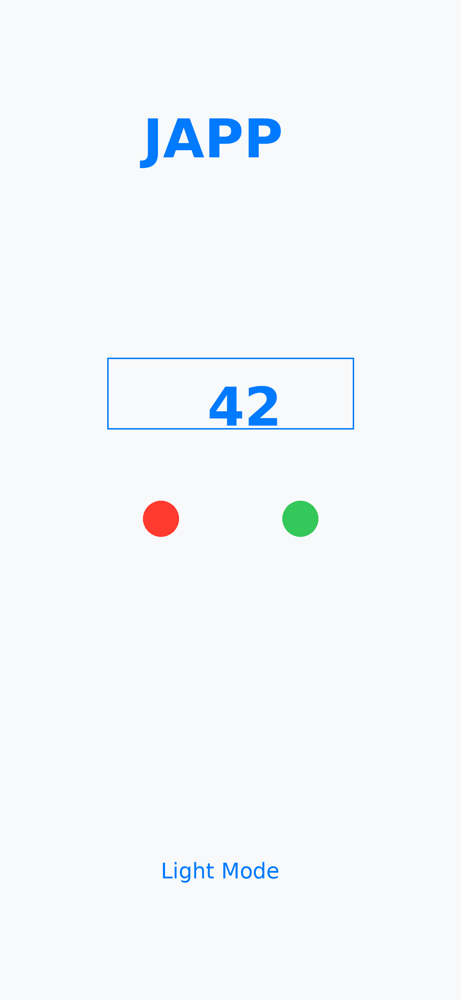
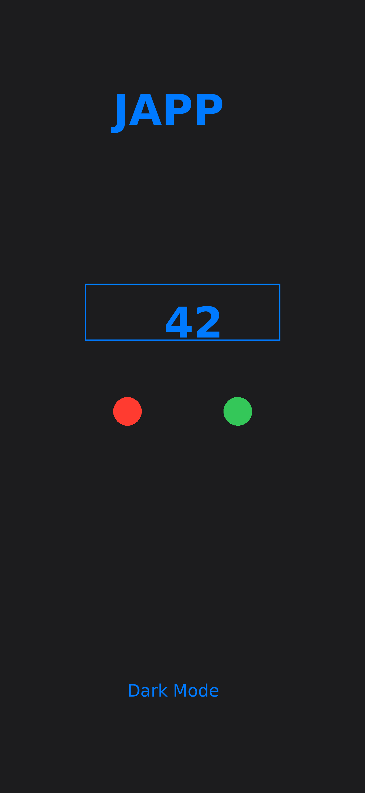

# 📱 JAPP - Compteur Simple pour iOS

<p align="center">
  
</p>

<p align="center">
  <strong>Une application de compteur simple et élégante pour iOS</strong>
</p>

<p align="center">
  <a href="https://github.com/Jefedi/iosapp-altstore/releases/latest">
    
  </a>
  <a href="https://github.com/Jefedi/iosapp-altstore/releases/latest/download/JAPP.ipa">
    
  </a>
  
</p>

## ✨ Fonctionnalités

- **➕ Compteur interactif** : Boutons + et - avec animations fluides
- **🔄 Reset facile** : Remettez le compteur à zéro d'un simple tap
- **🎨 Design moderne** : Interface SwiftUI élégante et intuitive
- **🌙 Mode sombre/clair** : Support automatique des thèmes système
- **⚡ Performant** : Code optimisé, aucune latence
- **📱 Universel** : Compatible iPhone et iPad

## 📸 Captures d'écran

<p align="center">
  
  
</p>

## 🚀 Installation

### Option 1: Installation directe (Recommandée)

1. **Téléchargez l'IPA** : [JAPP.ipa](https://github.com/Jefedi/iosapp-altstore/releases/latest/download/JAPP.ipa)
2. **Installez avec vos outils préférés** :
   - **AltStore** : Ouvrez AltStore → Appuyez sur + → Sélectionnez JAPP.ipa
   - **Sideloadly** : Glissez l'IPA dans Sideloadly et installez
   - **AltServer Direct** : Utilisez AltServer pour l'installation directe

### Option 2: Build depuis les sources

```bash
git clone https://github.com/Jefedi/iosapp-altstore.git
cd iosapp-altstore
open JAPP.xcodeproj
```

Puis buildez et installez via Xcode.

### ⚠️ Configuration post-installation

Après l'installation, allez dans :
**Réglages → Général → Gestion des appareils → Faites confiance à "Apple Development"**

## 🛠️ Configuration technique

- **Platform** : iOS 17.0+
- **Framework** : SwiftUI
- **Architecture** : ARM64 (iPhone/iPad)
- **Bundle ID** : `com.jefedi.japp`
- **Taille** : ~2MB

## 🔧 Développement

### Prérequis

- macOS Sonoma 14.0+
- Xcode 15.0+
- iOS 17.0+ SDK
- Compte développeur Apple (pour signing)

### Structure du projet

```
JAPP/
├── JAPP/
│   ├── JAPPApp.swift          # Point d'entrée de l'application
│   ├── ContentView.swift      # Interface principale SwiftUI
│   └── Assets.xcassets/       # Ressources (icônes, couleurs)
├── .github/
│   └── workflows/
│       └── build.yml          # CI/CD avec GitHub Actions
├── ExportOptions.plist        # Configuration export IPA
├── manifest.json              # Manifeste AltStore
└── index.html                 # Page de téléchargement
```

### Build automatique

Le projet utilise **GitHub Actions** pour automatiser les builds :

- ✅ Build automatique sur chaque push
- ✅ Export IPA avec signature automatique
- ✅ Création de releases GitHub
- ✅ Upload des artefacts

## 📦 Releases

Toutes les releases sont disponibles sur [GitHub Releases](https://github.com/Jefedi/iosapp-altstore/releases).

### Versions disponibles

- **v1.0** - Version initiale avec compteur de base

## 🤝 Contribution

Les contributions sont bienvenues ! Pour contribuer :

1. Forkez le projet
2. Créez une branche pour votre feature (`git checkout -b feature/nouvelle-feature`)
3. Committez vos changements (`git commit -m 'Ajout d'une nouvelle feature'`)
4. Pushez vers la branche (`git push origin feature/nouvelle-feature`)
5. Ouvrez une Pull Request

## 📋 Todo / Roadmap

- [ ] Sauvegarde de la valeur du compteur
- [ ] Historique des comptages
- [ ] Personnalisation des couleurs
- [ ] Widget iOS
- [ ] Support Apple Watch

## 🐛 Signaler un bug

Si vous trouvez un bug, veuillez [ouvrir une issue](https://github.com/Jefedi/iosapp-altstore/issues) avec :

- Description du problème
- Étapes pour reproduire
- Version iOS
- Captures d'écran si pertinentes

## 📞 Support

- **Documentation** : [GitHub Wiki](https://github.com/Jefedi/iosapp-altstore/wiki)
- **Issues** : [GitHub Issues](https://github.com/Jefedi/iosapp-altstore/issues)
- **Page web** : [jefedi.github.io/iosapp-altstore](https://jefedi.github.io/iosapp-altstore)

## 📄 Licence

Ce projet est sous licence MIT. Voir le fichier [LICENSE](LICENSE) pour plus de détails.

## 🙏 Remerciements

- Apple pour SwiftUI et les outils de développement iOS
- La communauté AltStore pour rendre le sideloading accessible
- Tous les contributeurs et utilisateurs de JAPP

---

<p align="center">
  <strong>Développé avec ❤️ par Jefedi</strong>
</p>

<p align="center">
  <a href="https://github.com/Jefedi/iosapp-altstore/releases/latest/download/JAPP.ipa">
    🔽 Télécharger JAPP maintenant
  </a>
</p>